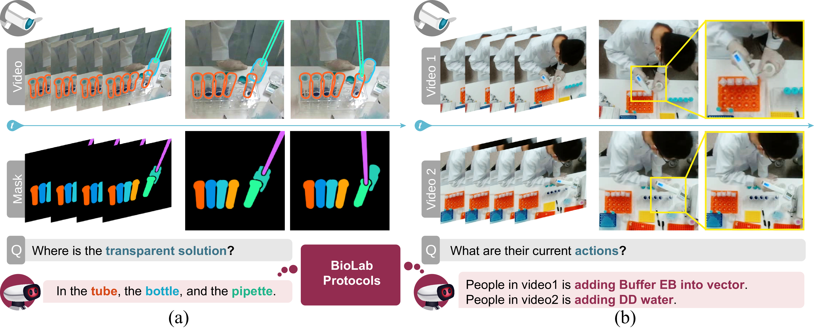

# ProBio: A Protocol-guided Multimodal Dataset for Molecular Biology Lab <br />(NeurIPS 2023 D&B Track)
<p align="left">
    <!-- <a href='https://scenediffuser.github.io/paper.pdf'>
      
    </a>
    <a href='https://arxiv.org/abs/2301.06015'>
      
    </a> -->
    <a href='https://probio-dataset.github.io/'>
      
    </a>
    <!-- <a href='https://huggingface.co/spaces/SceneDiffuser/SceneDiffuserDemo'>
      
    </a>
    <a href='https://drive.google.com/drive/folders/1CKJER3CnVh0o8cwlN8a2c0kQ6HTEqvqj?usp=sharing'>
       -->
    <!-- </a> -->
</p>

code for the paper "ProBio: A Protocol-guided Multimodal Dataset for Molecular Biology Lab"



The challenge of replicating research results has posed a significant impediment to the field of molecular biology. The advent of modern intelligent systems has led to notable progress in various domains. Consequently, we embarked on an investigation of intelligent monitoring systems as a means of tackling the issue of the reproducibility crisis. Specifically, we first curate a comprehensive multimodal dataset, named **ProBio**, as an initial step towards this objective. This dataset comprises fine-grained hierarchical annotations intended for the purpose of studying activity understanding in Molecular Biology Lab (BioLab). Next, we devise two challenging benchmarks, transparent solution tracking and multimodal action recognition, to emphasize the unique characteristics and difficulties associated with activity understanding in BioLab settings. Finally, we provide a thorough experimental evaluation of contemporary video understanding models and highlight their limitations in this specialized domain to identify potential avenues for future research. We hope **ProBio** with associated benchmarks may garner increased focus on modern AI techniques in the realm of molecular biology.


## Environment
python==3.8.16

You can install all the requirements via:
```bash
pip install torch==1.8.1+cu111 torchvision==0.9.1+cu111  -f https://download.pytorch.org/whl/torch_stable.html
pip install -r requirements.txt
```
Install **randaugment** via [this link](https://github.com/ildoonet/pytorch-randaugment/blob/master/setup.py).

## Data Preparation
1. Download our [processed data](https://drive.google.com/file/d/1IBHlKTDnBTdENKykp0s_ps6HvSuFvDLX/view?usp=sharing) and put it in ./ProBio.
2. Extract videos into frames and separate them into train, test, and val sets.
```bash
git clone https://github.com/jiemingcui/ProBio.git
cd ProBio/
unzip ProBio_dataset
mkdir -p ./data/autobio
mv ProBio_dataset/Kinetics/* ./data/autobio/
bash ./proprecess/reorg.sh
```

3. Reorganize all data as structure below:
```text
|-- data
    |-- autobio
        |-- clip_images
        |-- videos
        |-- autobio_labels.csv
        |-- autobio_test.csv
        |-- autobio_test_frames.txt
        |-- autobio_train.csv
        |-- autobio_train_frames.txt
        |-- autobio_val.csv
        |-- autobio_val_frames.txt
        |-- ambiguity.json
```

## Train
This model is trained on **1 NVIDIA 3090**
```
# train 
python train.py  --config ./configs/k400/autobio_train.yaml
```
## Test 
```
# test
python test.py  --config ./configs/k400/autobio_test.yaml
```

After the submission, we changed the way of sampling video data and further optimized the current model. As a result, there has been an improvement in performance. The improved results are shown in the table below:

| Category | Top1  | Top5  | Mean Top1 | Mean Top5 |
|----------|-------|-------|-----------|-----------|
| Overall  | 76.44 | 99.43 | 73.58     | 99.60     |

Special thanks to [Putao](https://putao537.github.io/) for his significant contribution to achieving this result.

## Question
If you get stuck after training to a certain number of steps, then please try to locate the Wandb problem.

## TODO
- [ ] Release the code for transparent solution tracking.


# Acknowledgments
Our code is based on [ActionCLIP](https://github.com/sallymmx/ActionCLIP), [CLIP](https://github.com/openai/CLIP), and [STM](https://openaccess.thecvf.com/content_ICCV_2019/papers/Jiang_STM_SpatioTemporal_and_Motion_Encoding_for_Action_Recognition_ICCV_2019_paper.pdf). Thanks for these great projects.

